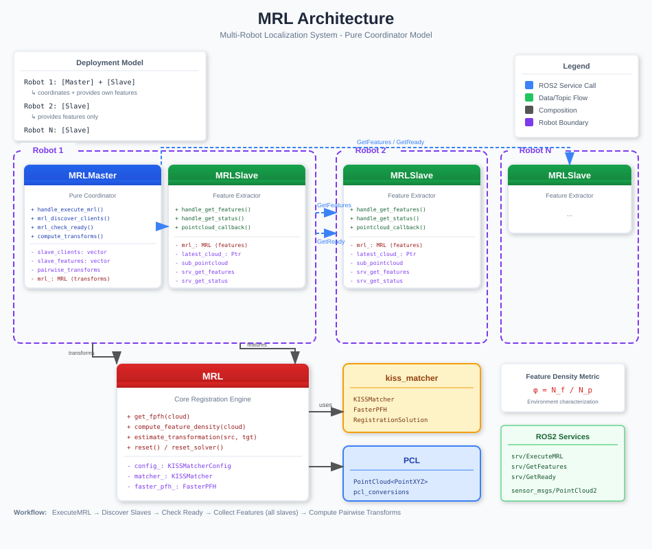

# MRL - Multi-Robot Localization

A ROS2 package for multi-robot localization using point cloud feature matching. MRL enables robots to determine their relative positions by extracting and matching geometric features from 3D point cloud data.

## Overview

MRL uses a **master-slave architecture** where:
- **Slaves** run on each robot, extracting FPFH (Fast Point Feature Histogram) features from LiDAR point clouds
- **Master** coordinates the localization process, collecting features from all slaves and computing pairwise transformations

The system leverages the [KISS-Matcher](https://github.com/MIT-SPARK/KISS-Matcher) library for robust point cloud registration.



## Features

- FPFH feature extraction from 3D point clouds
- Robust transformation estimation using KISS-Matcher
- Automatic robot discovery via announcement messages
- Static TF transform publishing for robot frames
- Support for repetitive and non-repetitive environments
- Point cloud accumulation for sparse sensor data
- Feature density metric for environment characterization

## Installation

### Prerequisites

- ROS2 (tested on Jazzy)
- PCL (Point Cloud Library)
- Eigen3
- [KISS-Matcher](https://github.com/MIT-SPARK/KISS-Matcher)
- hector_multi_robot_msgs

### Building

```bash
cd ~/ros2_ws/src
git clone <repository_url> mrl
cd ~/ros2_ws
colcon build --packages-select mrl
source install/setup.bash
```

## Usage

### Launching the Master Node

The master node coordinates the localization process:

```bash
ros2 launch mrl master.launch.py
```

Optional parameters:
- `namespace` - ROS namespace for the master node

### Launching Slave Nodes

Each robot runs a slave node for feature extraction:

```bash
ros2 launch mrl slave.launch.py robot_type:=ec_swift namespace:=/robot1
```

Parameters:
- `robot_type` - Robot type for configuration (e.g., `ec_swift`, `generic`)
- `namespace` - ROS namespace for the slave node

### Triggering Localization

Call the `execute_mrl` service on the master node:

```bash
ros2 service call /execute_mrl mrl/srv/ExecuteMRL
```

The master will:
1. Discover all announced slave robots
2. Check readiness of each slave
3. Collect FPFH features from all slaves
4. Compute pairwise transformations
5. Publish static TF transforms

## Configuration

### KISSMatcher Parameters (`config/mrl_config.yaml`)

```yaml
mrl_slave:
  ros__parameters:
    kissmatcher:
      use_voxel_sampling: true    # Enable voxel downsampling
      voxel_size: 0.3             # Voxel grid size (meters)
      normal_radius: 0.9          # Radius for normal estimation
      fpfh_radius: 1.5            # Radius for FPFH computation
      thr_linearity: 1.0          # Linearity threshold for filtering

mrl_master:
  ros__parameters:
    kissmatcher:
      voxel_size: 0.3
      robin_noise_bound_gain: 1.0
      solver_noise_bound_gain: 0.75
```

### Robot-Specific Configuration

Create a configuration file for each robot type in `config/`:

```yaml
# config/ec_swift.yaml
mrl_slave:
  ros__parameters:
    robot_type: "ec_swift"
    pointcloud_topic: "/ec_swift/front_lidar/points_raw"
    sensor_type: 0          # 0=LiDAR, 1=RGB-D, 2=Stereo
    is_repetitive: false    # Environment type
    acu_time: 2.0           # Accumulation time (seconds)
```

### Parameters

| Parameter | Type | Default | Description |
|-----------|------|---------|-------------|
| `pointcloud_topic` | string | `/pointcloud` | Point cloud input topic |
| `robot_type` | string | `generic` | Robot type identifier |
| `sensor_type` | int | `0` | Sensor type (0=LiDAR) |
| `is_repetitive` | bool | `true` | Whether environment has repetitive features |
| `acu_time` | double | `2.0` | Point cloud accumulation time (seconds) |

## Architecture

### Nodes

#### MRLMaster
- **Purpose**: Pure coordinator for multi-robot localization
- **Services Provided**: `execute_mrl`
- **Publishes**: Static TF transforms between robot frames

#### MRLSlave
- **Purpose**: Feature extraction from local point cloud
- **Services Provided**: `get_features`, `get_status`
- **Subscribes**: Point cloud topic

### Services

| Service | Type | Description |
|---------|------|-------------|
| `execute_mrl` | `mrl/srv/ExecuteMRL` | Triggers the full localization pipeline |
| `get_features` | `mrl/srv/GetFeatures` | Returns extracted FPFH features |
| `get_status` | `mrl/srv/GetReady` | Returns slave readiness status |

### Core Library (MRL Class)

The `MRL` class provides:
- `get_fpfh()` - Extract FPFH features from point cloud
- `estimate_transformation()` - Compute rigid transformation between point clouds
- `compute_feature_density()` - Calculate feature density metric

## Robot Discovery

MRL uses `hector_multi_robot_msgs/RobotAnnouncement` messages for automatic robot discovery. Each robot must run an announcer node that publishes to `/robot_announcement`.

The listener supports extensible robot type detection based on ID or namespace patterns.

## Deployment Model

```
Robot 1: [Master] + [Slave]
  └─ coordinates + provides own features

Robot 2: [Slave]
  └─ provides features only

Robot N: [Slave]
  └─ provides features only
```

## Workflow

1. **ExecuteMRL** service called on master
2. **Discover Slaves** via robot announcements
3. **Check Ready** status of all slaves
4. **Collect Features** from all slaves (FPFH extraction)
5. **Compute Pairwise Transforms** using KISS-Matcher
6. **Publish Static TF** transforms

## Feature Density Metric

MRL provides a feature density metric for environment characterization:

```
φ = N_f / N_p
```

Where:
- `N_f` = number of extracted geometric features
- `N_p` = total number of points

Higher values indicate more geometrically informative scenes suitable for feature-based registration.

## File Structure

```
mrl/
├── config/
│   ├── mrl_config.yaml      # KISSMatcher parameters
│   └── ec_swift.yaml        # Robot-specific config
├── doc/
│   └── architecture.svg     # Architecture diagram
├── include/mrl/
│   ├── mrl.h                # Core MRL class
│   ├── mrl_master.h         # Master node header
│   ├── mrl_slave.h          # Slave node header
│   ├── mrl_listener.hpp     # Robot discovery
│   └── mrl_utils.hpp        # Utility functions
├── launch/
│   ├── master.launch.py     # Master launch file
│   └── slave.launch.py      # Slave launch file
├── src/
│   ├── mrl.cpp              # Core implementation
│   ├── mrl_master.cpp       # Master node
│   └── mrl_slave.cpp        # Slave node
├── srv/
│   ├── ExecuteMRL.srv       # Execute service
│   ├── GetFeatures.srv      # Feature service
│   └── GetReady.srv         # Status service
├── CMakeLists.txt
└── package.xml
```

## Dependencies

- rclcpp
- sensor_msgs
- geometry_msgs
- std_msgs
- tf2_ros
- tf2_geometry_msgs
- pcl_conversions
- hector_multi_robot_msgs
- kiss_matcher

## License

TODO: License declaration

## Authors

- MRL Team
- Maintainer: aaron.wickert@stud.tu-darmstadt.de
